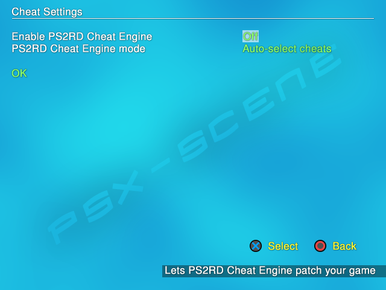

.. _cheat_settings:

**Cheats settings**
===================

| ----
| *[Default values are marked in bold]*

Open PS2 Loader 0.9.3 features `PS2 Remote Debugger aka
PS2RD <http://psx-scene.com/forums/official-ps2rd-forums/>`__ cheat
engine 0.5.3 version (0.5.3.65.g774d1). PS2RD cheat engine allows you to
use cheats with your PS2 games. It is disabled by default so you need to
enable it if you want to use it [Menu > Cheats Settings > Enable PS2RD
Cheat Engine > ON – then Save changes in OPL Menu].

Most of the cheats are – of course – per-game specific. You will need to
manually write them into a text file named <game_ID>.cht (example for
Okami : SLES_544.39.cht) and place them into the CHT folder.

**Notes :**

-  Be aware that using commerical cheat engines (i.e. Codebreaker) with
   a PS2RD enabled build of OPL will result in a BSOD every time at game
   launch. You must use a non-PS2RD build for commercial cheat engines.
-  PS2RD only accepts PS2 RAW codes (unencrypted) so you may need to
   convert your cheats using a tool like
   `Omniconvert <http://gamehacking.org/vb/threads/6700-Omniconvert>`__.
-  PS2RD only accepts 9 type master codes (codes that start with 9). You
   can use
   `mastercodefinder <http://psx-scene.com/forums/f293/mastercode-finder-110898/>`__
   from pelvicthrustman for this (easiest method) or you can do this
   manually following lee4’s
   `guides <http://www.codemasters-project.net/guides/showentry.php?e=902&#38;catid=2>`__
   (more advanced). A list can also be found at
   `PSX-scene <http://psx-scene.com/forums/f173/master-codes-ps2rd-listings-requests-123634/>`__.
-  Codes NEED a master code to work.
-  Keep in mind that codes are region specific : you can’t use a NTSC
   code over a PAL game and vice versa.
-  Good place for cheats :
   @\ `gamehacking.org <http://gamehacking.org/system/ps2>`__.

**Example :**

SLES_544.39.cht file content :

::

   Master Code
   9020FB28 0C0FBB2A
   Widescreen Code
   201974d4 3c014455
   20344864 3c014455

**Cheats settings screen :**

-  **Enable PS2RD Cheat Engine :** < **OFF** / ON > – pretty obvious :
   toggles PS2RD ON so you can use cheats with your games.

-  **PS2RD Cheat Engine Mode :** < **Auto-select cheats** / Select game
   cheats > – first option enables all cheats inside the <game_ID>.cht
   file while second option allows you to select cheats from the
   <game_ID>.cht file. This second option is not implemented ATM.

-  Press **OK** to validate the changes and exit this screen – or press
   |title| or |image1| (according to the select button you choose in the
   settings screen) – to go back to the previous screen without any
   changes made.

**Limitations :** max number of codes in the cht file is 250 or 510
(???).

