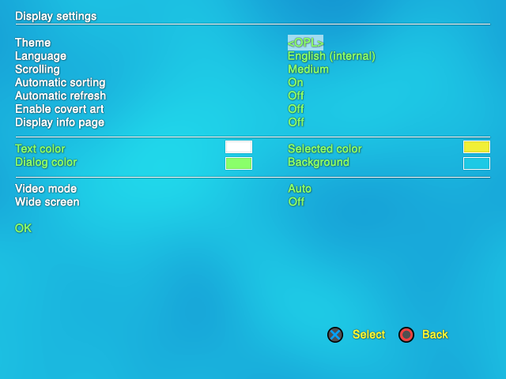

.. _display_settings:

**Display settings screen**
===========================

| ----
| *[Default values are marked in bold]*

You can access the Display settings screen by pressing |start| from
games/apps pages then selecting Display settings in the menu. This
screen allows you to set OPL main display and behaviour settings (not
the games display settings – see :ref:`GSM page <gsm>` for this).

**Display settings screen :**

-  **Theme :** < **OPL** > – OPL is customizable. If you placed any
   themes (named as thm_name_of_your_theme, uncompressed) in the THM
   folder on the device you launch your games from (the device must be
   enabled) they will be listed and you can select them. You can browse
   the theme gallery
   :ref:`here <theme_gallery>`.
   Also, please note that 0.8 themes are not compatible with 0.9.X (and
   vice versa) – they need to be converted (more info
   `here <http://psx-scene.com/forums/f150/share-your-theme-art-oplv0-9-beta-80461/index43.html#post1000191>`__)

-  **Language :** < **English (internal)** / (other) >

OPL uses English as build-in language. This setting can be changed if
you use a custom language file provided by a translator. OPL 0.9.3 was
translated into 17 languages (see list at the end of the page) and the
language pack is included in the bundle. In order to use another
language than english, place the language file you choose (ends with
.lng extension) in mc#:/OPL folder (only location available). Some
languages require also a font that contains specific characters (such as
é or è for example) to be properly displayed. TTF and OTF font files are
supported (and included when need in the language pack). Font files can
be load from 2 locations (and reads in this order) : +OPL (root of your
OPL partition – HDD must be set on auto) and mc#:/OPL folder. If not
used, OPL will use its enbedded font (FreeSans.ttf) – but expect
garbage. For more info about language and font, read the language pack
readme.txt file. You can submit a new language translation
`here <http://psx-scene.com/forums/f150/opl-0-9-3-official-beta-revisions-language-pack-156212/>`__.

-  **Scrolling :** < Slot / **Medium** / Fast > – allows you to select a
   scrolling speed to navigate in the menus and games/apps pages.

-  **Automatic sorting :** < Off / **On** > – set it to ON for
   alphabetical listing order, OFF for installed listing order.

-  **Automatic Refresh :** < **Off** / On > – OPL will poll your device
   to check if the games list you are currently in needs to be
   refreshed. This is useful for USB device swapping, and also for SMB
   mode if you added/deleted any games on your Share while OPL is
   running. If you can encounter an issue with this being ON, you can
   disable it by setting it to OFF. While OFF, you can still manually
   refresh the games list by pressing SELECT.

-  **Enable Cover Art :** < **Off** / On > – set it to ON if you want to
   use ARTs (covers, icons, backgrounds, screens…). Be sure to enable
   the device they are stored on. If you use several devices, you need
   to copy your ART folder (and its content) on all of them.

-  **Display info page :** < **Off** / On > – this option allows for an
   extra page of information to be displayed by OPL prior to launching a
   game. The page is configurable (See Themes section) and some themes
   for OPL 0.9.X may require this option to be enabled for full
   functionality. OPL build-in GUI doesn’t support info page. See a
   sample of an example of info-page
   :ref:`here <info_page_sample>`.

----

**Colors :** this option allows to change OPL default GUI colors. It not
available when using a custom theme (you have to manually edit the
conf_theme.cfg of the theme for this.)

Press the select button and a color selection screen will open to allow
you to make color changes. Press Up / Down to choose between red / green
/ blue. Press left / right to change color. Press the select button
again to set the changes and return to the previous screen. Press the
cancel button (either X or O, according to your choice) to return to the
previous screen without any changes.

-  **Text color :** color used to render text on screen.

-  **Dialog color :** color used to render text of the dialog items.

-  **Selected color :** color used for the current selected text item.

-  **Background color :** defines the background color, which is used
   for the background in color mode, and for the plasma color.

----

-  **Video Mode :** < **Auto** / (others) > – this option lets you set
   the video mode OPL uses in the GUI. Valid options are AUTO, PAL, and
   NTSC – à compléter -. It is recommended to leave this mode to Auto as
   some bugs regarding themes, artwork, and games lists exist when this
   is set to any other mode. (tjs valide .)

-  **Wide screen :** < **Off** / On > – you can set this option to ON if
   you’re using a widescreen TV or Monitor. This option allows to not
   stretch ARTs and themes elements if used (and if the theme is
   properly coding and supports wide screen mode).

**Note :** the last two settings are for **OPL GUI only**, not for
games.

----

-  Press **OK** to validate the changes and exit this screen – or press
   |title| or |image1| (according to the select button you choose in the
   settings screen) – to go back to the previous screen without any
   changes made.

----

**OPL 0.9.3 language pack content :**

::

   Arabic - translated by @LightWave
   Bulgarian - translated by @wisi
   Czech - translated by @JimmySmith
   French - translated by @ShaolinAssassin
   German - translated by ps2guy
   Indonesian - translated by verislasher
   Italian - translated by @jauffreBlades
   Laotian - translated by blackbutterfly
   Polish - translated by @dragolice
   Portuguese-BR - translated by @gledson999
   Portuguese - translated by danielb
   Russian - translated by druchapucha &#38; frodosumkin
   Spanish - translated by @ElPatas
   Swedish - translated by Flaya
   Traditional Chinese - translated by @kane159
   Turkish - translated by dante

.. |start| image:: 568074192-start.png
.. |title| image:: 74665754-cross.png
.. |image1| image:: 4184835271-circle.png
