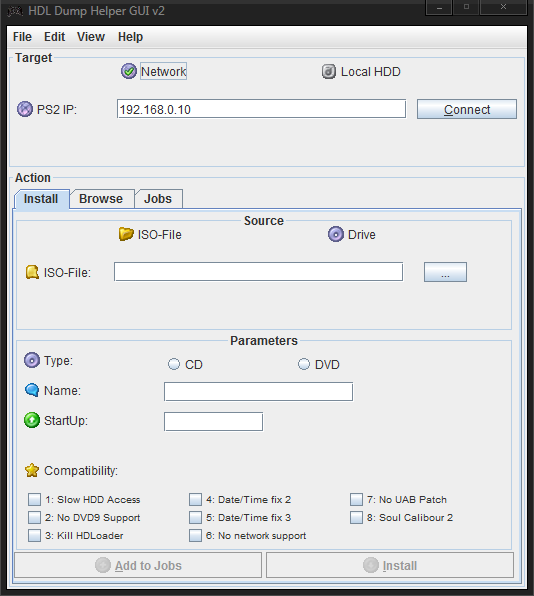

.. _hdl_server:

**HDL Server**
==============

Open PS2 Loader 0.9.3 features an integrated HDL server, that allows you
to install your games onto your internal HDD over the network. It’s
disabled and hidden by default. You need to enable your HDD [Settings >
HDD device start mode > AUTO or MANUAL] and enable write operations
[Settings >Enable write operations > ON] before using it. It’s located
in main OPL menu.

You will also need to have your network config properly set so an IP can
be assigned to your PS2. See :ref:`Network config <network_config>`
page to know how to.

Finally, you will need a PC client. I suggest you to use `HDLDump Helper
GUI
v2.3 <https://bitbucket.org/ShaolinAssassin/open-ps2-loader-0.9.3-documentation-project/downloads/HDLDump%20Helper%20GUI%20v2.3.7z>`__
(set on hdl_dump_086 version – already done in the archive).

**How to use it :**

**1.** [PS2] Start HDL Server from OPL Menu.

**2.** [PC] When HDL server status switches from “HDL Server starting”
to “HDL Server running”, run HDLDump Helper GUI v2.3.

**3.** [PC] Enter you PS2 IP adress and click on “Connect”.

**4.** [PC] Once the connection is done between your PC and your PS2, a
bar will appear, showing you how much space left on your HDD.

**5.** [PC] “Install” tab allows you to install games, “Browse” allows
you to see which games are install on your HDD and delete them from
there, “Jobs” tab allows you to see the next tasks if you want to
install several games at once.

**6.** [PC] To install a game, select the source (either ISO or CD drive
from your PC), specify if it’s a CD or DVD, enter a name for you game
(up-to 32 characters) and “start-up” (i.e. the main ELF of your game)
should be detected).

**7.** [PC] Do not bother yourself about Compatibility modes, these are
for HDLoader and they will be ignored by OPL. If you want to install
several games at once, click on “Add to jobs”, otherwise / once done,

**8.** [PC] click “Install” and go enjoy a coffee/cig combo (smoking is
bad for health, BTW :P ).

**9.** [PC] Once the install is completed, close HDLDump Helper GUI
v2.3.

| **10.** [PS2] You can now unload HDL Server, by pressing the un-select
  button and go back to main OPL menu.
| Congrats, you did it.
