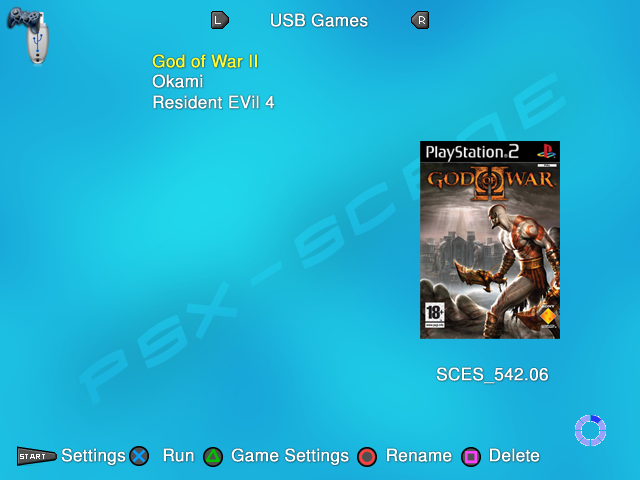

**Navigation/controls**
-----------------------

*In the menus :*
----------------

This is how OPL will look like when you will launch it for the first
time. Indeed, all devices supported (USB, SMB server and internal HDD)
are disabled by default. You first need to enable one of them to be able
to see the game list : [Settings > Device_of_your_choice start mode >
AUTO > OK]. Then you need to save this change [Saves changes].

**Controls in OPL menus (defaults) :**

+--------------------+------------------------------------------------+
| **Control(s)**     | **Action**                                     |
+--------------------+------------------------------------------------+
| |title| / |image7| | Scroll items list / Scroll possible values for |
|                    | each item when an item is selected (example :  |
|                    | ON/OFF).                                       |
+--------------------+------------------------------------------------+
| |image8|           | Select highlighted item / Set selected change. |
+--------------------+------------------------------------------------+
| |image9|           | Return to previous page without any changes    |
|                    | made.                                          |
+--------------------+------------------------------------------------+

-  **Note :** the select button can be switched to |image10| in the
   Settings screen.

----

*In the Games & apps pages :*
-----------------------------

+-----------------------+---------------------------------------------+
| **Control(s)**        | **Action**                                  |
+-----------------------+---------------------------------------------+
| |title| / |image37|   | Scroll 1 Item at a time, up or down.        |
+-----------------------+---------------------------------------------+
| |image38| / |image39| | Browse the devices pages, from left to      |
|                       | right and vice versa. You can’t access a    |
|                       | device page if its start mode is not at     |
|                       | least set to MANUAL.                        |
+-----------------------+---------------------------------------------+
| |image40|             | Scroll 1 page at a time down.               |
+-----------------------+---------------------------------------------+
| |image41|             | Scroll 1 page at a time up.                 |
+-----------------------+---------------------------------------------+
| |image42|             | Scroll to the bottom of the list.           |
+-----------------------+---------------------------------------------+
| |image43|             | Scroll to the top of the list.              |
+-----------------------+---------------------------------------------+
| |image44|             | Access main menu screen.                    |
+-----------------------+---------------------------------------------+
| |image45|             | Refresh the list manually. Can be done      |
|                       | automatically by setting Automatic refresh  |
|                       | in Settings screen to ON.                   |
+-----------------------+---------------------------------------------+
| |image46|             | Access the Game settings screen for the     |
|                       | highlighted game.                           |
+-----------------------+---------------------------------------------+
| |image47|             | Enable the device if set to manual / Run    |
|                       | the highlighted game or launch the ELF in   |
|                       | the APPS page. / Open the info page when    |
|                       | you use a theme that supports this feature. |
+-----------------------+---------------------------------------------+
| |image48|             | Delete a game from your device. Hidden by   |
|                       | default. You need to Enable write           |
|                       | operations in the Settings screen to access |
|                       | this feature (not recommended).             |
+-----------------------+---------------------------------------------+
| |image49|             | Rename a game – open OPL virtual keyboard.  |
|                       | Hidden by default. You need to Enable write |
|                       | operations in the Settings screen to access |
|                       | this feature (not recommended).             |
+-----------------------+---------------------------------------------+

Some of these controls can be customized to your needs in the Settings
and Display settings screens (speed scrolling, select button, show/hide
write operation…)

.. |title| image:: 3384562877-up.png
.. |image1| image:: 838487360-down.png
.. |image2| image:: 74665754-cross.png
.. |image3| image:: 4184835271-circle.png
.. |image4| image:: 838487360-down.png
.. |image5| image:: 74665754-cross.png
.. |image6| image:: 4184835271-circle.png
.. |image7| image:: 838487360-down.png
.. |image8| image:: 74665754-cross.png
.. |image9| image:: 4184835271-circle.png
.. |image10| image:: 4184835271-circle.png
.. |image11| image:: 838487360-down.png
.. |image12| image:: 1961399068-left.png
.. |image13| image:: 3335558195-right.png
.. |image14| image:: 3407914923-R1.png
.. |image15| image:: 359344587-L1.png
.. |image16| image:: 2989855896-R2.png
.. |image17| image:: 3537024755-L2.png
.. |image18| image:: 568074192-start.png
.. |image19| image:: 3991913910-select.png

.. |image21| image:: 74665754-cross.png

.. |image23| image:: 4184835271-circle.png
.. |image24| image:: 838487360-down.png
.. |image25| image:: 1961399068-left.png
.. |image26| image:: 3335558195-right.png
.. |image27| image:: 3407914923-R1.png
.. |image28| image:: 359344587-L1.png
.. |image29| image:: 2989855896-R2.png
.. |image30| image:: 3537024755-L2.png
.. |image31| image:: 568074192-start.png
.. |image32| image:: 3991913910-select.png

.. |image34| image:: 74665754-cross.png

.. |image36| image:: 4184835271-circle.png
.. |image37| image:: 838487360-down.png
.. |image38| image:: 1961399068-left.png
.. |image39| image:: 3335558195-right.png
.. |image40| image:: 3407914923-R1.png
.. |image41| image:: 359344587-L1.png
.. |image42| image:: 2989855896-R2.png
.. |image43| image:: 3537024755-L2.png
.. |image44| image:: 568074192-start.png
.. |image45| image:: 3991913910-select.png

.. |image47| image:: 74665754-cross.png

.. |image49| image:: 4184835271-circle.png
