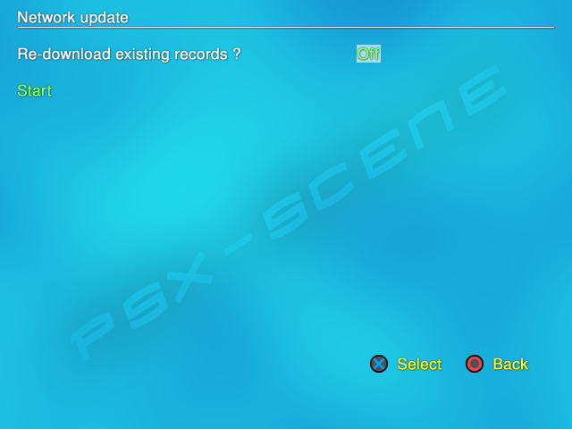

.. _network_update:

**Network update**
==================

| ----
| *[Default values are marked in bold]*

Open PS2 Loader 0.9.3 has an embedded Network feature, that allows you
to download <game_ID>.cfg files from
`OPL-CL <http://sx.sytes.net/oplcl/games.aspx>`__ site. You can access
its main page in OPL menu [Menu > Network update]. <game_ID>.cfg files
are stored in your CFG folder and contain games settings data (such as
compatibility modes reported by users…) and game informations that can
be displayed on the info page (you need to use a theme that supports
info page for that). The Network update is disabled by default so you
need to enable it in its page before using it.

| To be able to use the Network update feature, you first need to go the
  Network settings screen, then set the DNS server IP adress :
| . if you’re using a router/switch in your network, that is your DNS
  server.
| .

**Network update screen :**

-  **Re-download existing records ?** < **Off** / On > – set it to ON to
   enable the Network update feature.

-  **Start** : when selected, starts bulk download all <game_ID>.cfg
   files for (only) your games from opl-cl site (as long as they exist
   on the site). OPL connects to the server and a progress bar appears
   on the screen – sorry if I spoil too much :P

You can also use the Network update feature from the :ref:`Game settings <game_settings>`
screen [Download defaults option]. Using it from there will let you
download the <game_ID>.cfg file for only this particular game.

**Notes :**

-  OPL-CL still is still WIP – reports from registred users is not
   implemented yet. In the waiting, you can make your reports
   `here <http://psx-scene.com/forums/f150/open-ps2-loader-official-compatibility-list-thread-156233/>`__
   and a maintainer will add your report himself to the data base;
-  That it is a collaborative feature : if no one “feeds” it, there is
   nothing to download;
-  You can also download <game_ID>.cfg files from your computer,
   connected to the site;
-  More info about OPL-CL site can be found
   `here <http://psx-scene.com/forums/f150/open-ps2-loader-compatibility-list-site-132906/>`__
   ;
-  Last, <game_ID>.cfg files downloaded will be flagged as
   $ConfigSource=2 (other values : 0 or if missing = defaults by OPL, 1
   = user-modified within OPL) – useless info for the user, just for the
   records.
