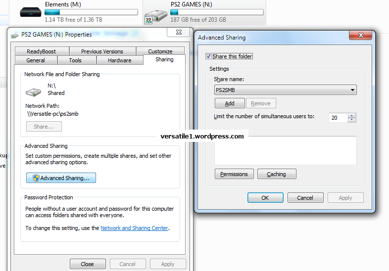
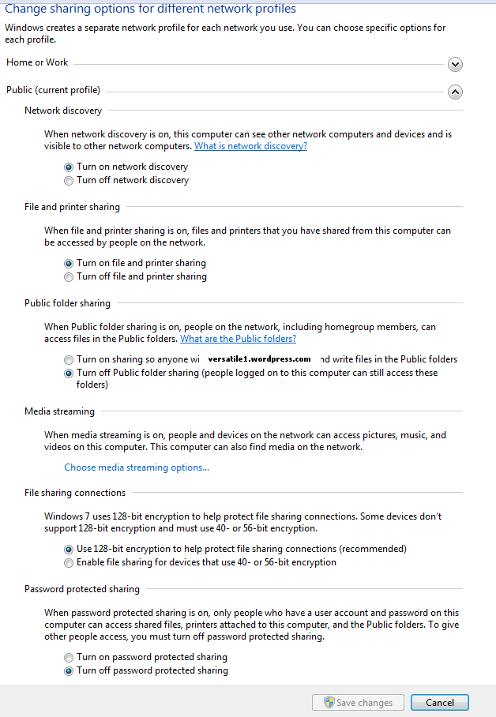

**File sharing – Windows 7**
============================

**Sharing your PS2 folder :**

| 1. Right-click on the folder you want to share, then go to “Share
  with” tab ;
| 2. Select “Specific people” ;
| 3. Choose “Everyone” and set properties for “Everyone” to
  “read/write”.

**Setting a share name :**

| 4. Right click on your shared folder, and go to “Properties”, and then
  “Sharing Tab” ;
| 5. Click on “Advanced Sharing” and then click on “Share this folder”.
| 6. Give share name the name PS2SMB (default name) – or any name you
  want, but it must match into OPL network configuration. Click OK.

**Setting your network profile :**

7. Now click on “Network and Sharing Center”(blue link as shown in the
picture above). Under the Public profile, please configure it as shown
in the screenshot below :

| **Sources :**
| . `OPL 0.8 User
  Guide <http://opl.sksapps.com/index.php?opl=config_net.html>`__.
| . `Welcome to the Underground
  blog <https://versatile1.wordpress.com/2010/03/15/how-to-boot-games-off-network-smb-with-playstation-2-ps2-using-openps2loader-a-novice-guide/>`__.
